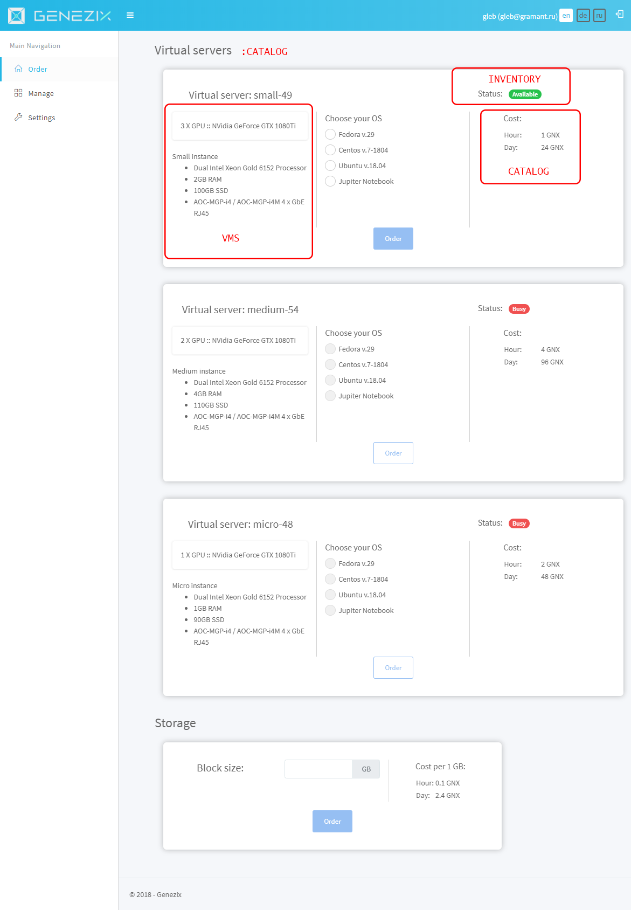
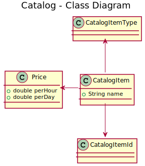
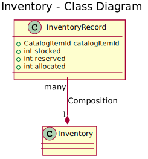

# Genezix

---

---

Стандартный подход:

1. Сущность (что хранить -> таблица БД -> Java-класс). Получили `Equipment.java`, представляющий структуру для хранения.
2. Сервис (операции с сущностью). Получили `EquipmentService.java`, для операций с `Equipment.java`
3. ДАО и прочее

На другой странице другие данные? Делаем новую таблицу, сущность, сервис.

Очень удобно?

---

Что не так со стандартным подходом?

Дизайн завязывается на пользовательское представление (что увидели, то и воспроизвели в БД).

* Поменялось представление?
* Добавились поля?
* Изменился сценарий?

---

Как можно сделать иначе?

---

Контексты в предметной области

---

---

---

---

Архитектурные принципы
